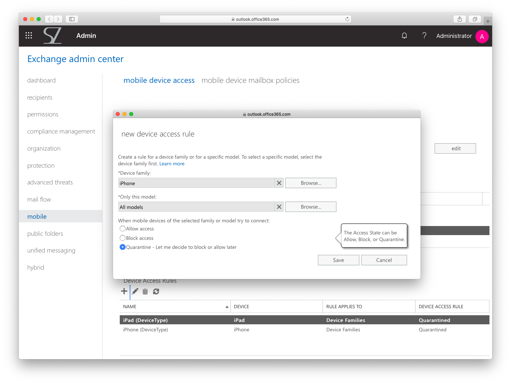
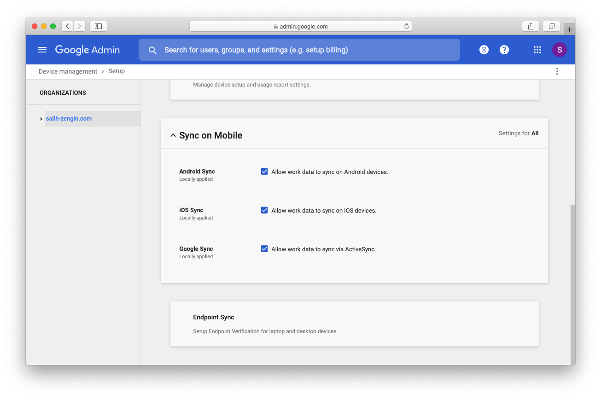

# Blocking iOS Email Active Sync Exchange Online or G Suite

The [Mail app bug](https://blog.zecops.com/vulnerabilities/youve-got-0-click-mail/) could be a big problem in your compant environment.  
Apple [confirmed](https://www.forbes.com/sites/gordonkelly/2020/04/26/apple-iphone-exploit-vulnerability-ios-13-mail-problem-iphone-11-pro-max-u-iphone-xs-max-xr-update/?ss=consumertech#53c1febe43a8) the issue but a better way to keep the company files secure is to disable and block the Active Sync for iOS.
Also after Apple releases a new update, this doesn't mean that your users will also update their devices immediately. 

## Blocking iOS email Active Sync for Exchange Online

To block Exchange ActiveSync in your Exchange environment, you need *minimum* an Exchange Online admin role in Microsoft 365.
So visit admin https://admin.microsoft.com/ go to admin center and click *Exchange*.

In the Exchange admin center, on the left, you will find the tab *mobile*.
Here you can add in *Device Access Rules* different types of devices. Here I will add iPad and iPhone, the whole device families.
Instead of blocking, I recommend setting the devices to quarantine. (The benefit is you can allow access again after Apple releases a new iOS update).
Under *Quarantined Devices* you will see all devices and can check which iOS update is installed.
You can also set a custom text which will be added to messages sent to users by Exchange.

## Blocking iOS email Active Sync for G Suite

Here, I didn't try but there is also a setting for this.
In Admin Settings -> Device management -> Setup. Choose your domain and uncheck the box for "Allow work data to sync on iOS devices".
I don't know if this deny all iOS devices in general or only these with Apple Mail app and Active Sync. But in both cases I recommend unchecking this and use the web access for G-Suite (if the Google Mail is not working).

